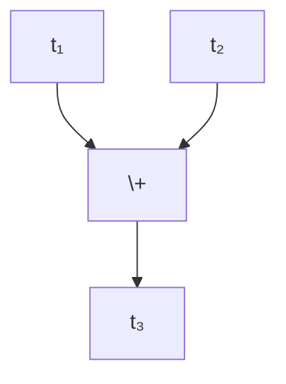
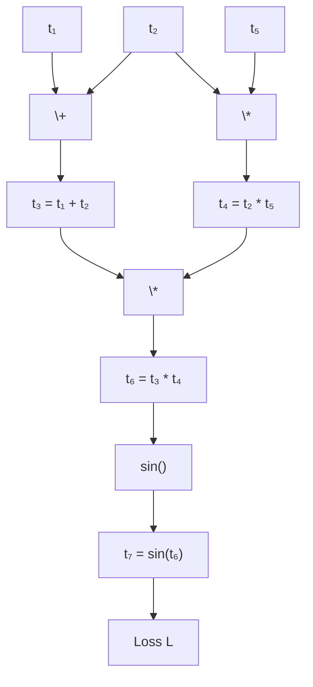

## What an Autograd System Is

Automatic differentiation (autograd) systems are the backbone of modern machine learning libraries such as TensorFlow, Keras, and PyTorch.  

The general purpose of an autograd system is to **abstract away the complexity of manual partial differentiation**. Instead of computing derivatives by hand, the user only needs to define how their model transforms inputs into outputs. The library then takes care of computing gradients, which are crucial for optimization algorithms like gradient descent.  

At their core, autograd systems rely on:

- **Tensors** as the fundamental data structure.
- **A computational graph** that records the operations applied to those tensors.

For example, consider two tensors, $t_1$ and $t_2$. If we define:

$$
t_3 = t_1 + t_2,
$$

This creates the computation graph of:

then during backpropagation the system traverses the computation graph backwards and calculates the partial derivative:

$$
\frac{\partial t_3}{\partial t_1} = 1, \quad \frac{\partial t_3}{\partial t_2} = 1.
$$

These local derivatives are stored as part of the computational graph. More complex expressions can be handled by recursively applying the chain rule.

## Why They Are Needed (Manual Gradient Calculation)

Without automatic differentiation, training a neural network would require you to manually derive gradients for every parameter with respect to the loss function. For small models this might be feasible, but real-world neural networks have **millions or even billions of parameters**.  

Manual differentiation is:

- Error-prone
- Time-consuming
- Difficult to maintain when models change

Autograd systems solve this by building the computational graph dynamically and applying backpropagation automatically.

## Backward Functions

Each operation in the computational graph has an associated **backward function**.

- The forward pass computes the output given inputs.  
- The backward pass computes the gradient of the output with respect to the inputs.

Example:  
For multiplication, $z = x \cdot y$, the backward function defines:

$$
\frac{\partial z}{\partial x} = y, \quad \frac{\partial z}{\partial y} = x.
$$

This way, when the graph is traversed backward, the contributions to each input gradient are accumulated.

## Backward Pass Scheduling (Graph Theory)

The computational graph is a **directed acyclic graph (DAG)** of tensor operations. During backpropagation, we must traverse this DAG in the correct order to ensure that all dependencies of a node's gradient are computed before the node itself.

To visualise why this is needed take the following graph as an example:

Forward pass:

When computing the backward pass, we can see that $t_2$ is used in **both the addition and multiplication operations**, so its gradient depends on contributions from **both paths**. Specifically:

\[
\frac{\partial L}{\partial t_2} = \frac{\partial L}{\partial t_3} \cdot \frac{\partial t_3}{\partial t_2} + \frac{\partial L}{\partial t_4} \cdot \frac{\partial t_4}{\partial t_2}
\]

This means we must **schedule the backward computation carefully**:

1. Compute $\frac{\partial L}{\partial t_7}$ and propagate through the subsequent nodes ($t_6, t_3, t_4$).  
2. Ensure that both contributions to $t_2$, from the **add node** ($t_3 = t_1 + t_2$) and the **mul node** ($t_4 = t_2 \cdot t_5$) are computed first.  
3. Only then can we accurately accumulate $\frac{\partial L}{\partial t_2}$.

In other words, the backward pass **must respect the dependency graph**, otherwise gradients for nodes like $t_2$ would be incomplete.

Two common approaches are:

### Depth-First Search (DFS)

A recursive traversal from the output node back to its inputs.  

- Simple to implement  
- Naturally aligns with recursive application of the chain rule  
- Can hit recursion limits for very deep networks  

### Kahn’s Algorithm (Topological Ordering)

Kahn’s algorithm produces a topological ordering of the nodes in the DAG.  

- Ensures gradients are computed in strict dependency order  
- More iterative and memory-friendly  
- Useful for frameworks that need explicit scheduling  

---
